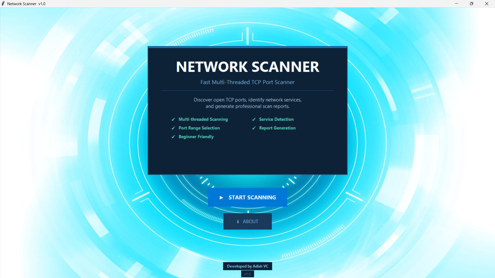
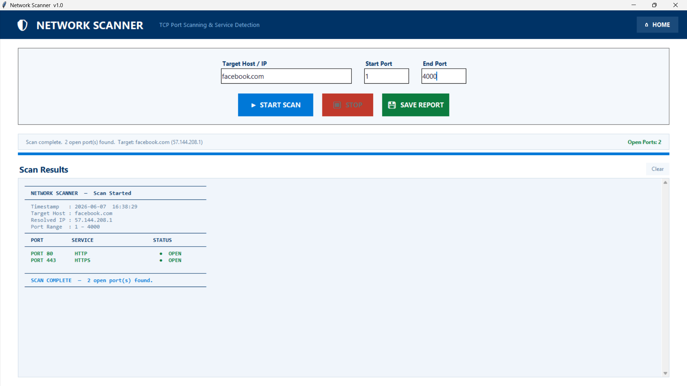

# Network Scanner v1.0

A multi-threaded TCP port scanner with service detection, report generation, and a professional Tkinter GUI.

## Features

- TCP Port Scanning
- Service Detection
- Multi-threaded Architecture
- Save Scan Reports
- Professional GUI Interface
- Hostname and IP Resolution

## Technologies Used

- Python
- Tkinter
- Socket Programming
- Threading
- 
## Screenshots

### Home Page

### Scanner Page

## Developer

Adish VC
